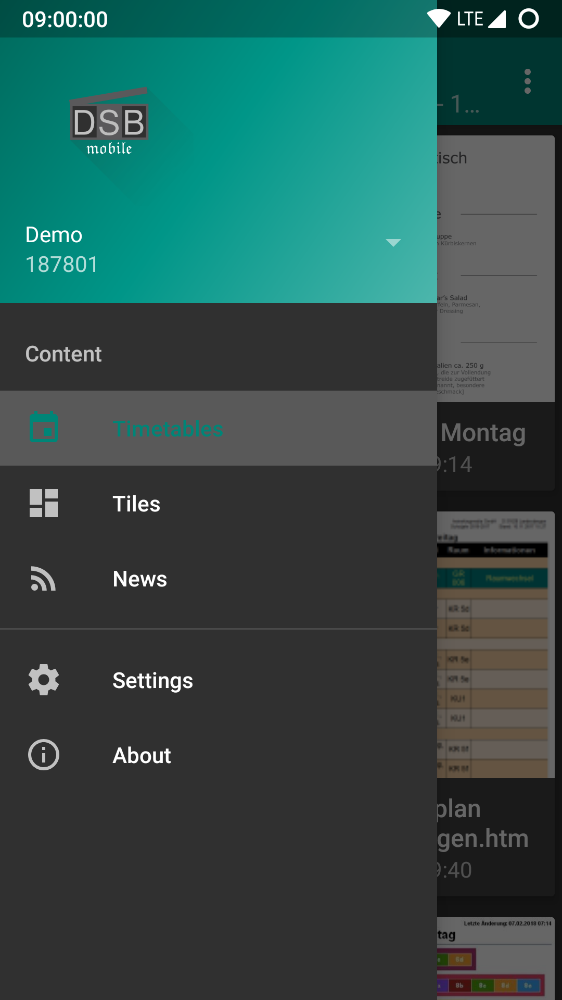

# OpenDSBmobile
An open source DSBmobile content viewer to replace the proprietary app on Google Play.

This project was started because the original app is slow and ugly. Besides that, this app adds functionality: First, it implements a smart caching system that allows content to be viewed without internet access. Secondly, it allows content to be shared with other apps and contacts as link, image, raw text, or screenshot. And one last feature many users might appreciate: light and dark theme.

Another feature that is not finished yet is a notification engine that checks for content updates. It is based on Android's account and sync service. Currently, it pushes a notification whenever the url to an item changes or is added to the index. However, that does not guarantee that the file itself has changed too, which results in way too many notifications to be sent. Thus, the todo list is as follows:

- Implement a proper file comparison algorithm (something like diff) that is configurable (i.e. a filter that picks specific cells in an html table)
- Implement a sorting algorithm (to provide feature parity)

Screenshots:

|  |  |
|:---:|:---:|
|  |  |
|  |  |
|  |  |
|  | |
